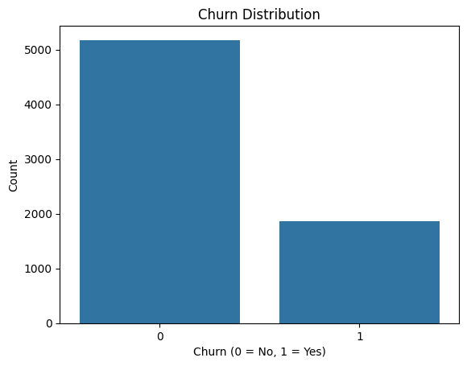
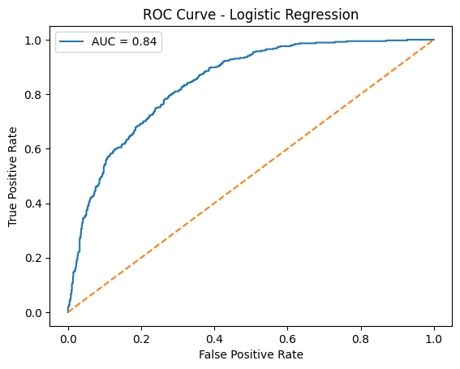
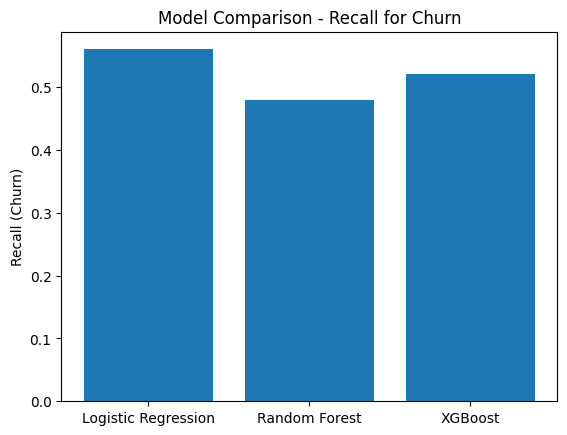

# Customer Churn Prediction

## 🚀 Project Overview
This project explores customer churn prediction using the Telco Customer Churn dataset.  
The goal is to build machine learning models to predict which customers are likely to leave (churn) based on their account and service usage.

---

## 📊 Dataset
The dataset contains 7043 customer records and 20 feature columns including:
- Demographics (gender, senior citizen, etc.)
- Service usage (Internet, Phone, Tech support, etc.)
- Billing information (MonthlyCharges, TotalCharges, etc.)
- Target column: **Churn**

---

## 🧹 Data Preprocessing
- Identified and handled missing values
- Converted TotalCharges to numeric
- Encoded categorical features using OneHotEncoder
- Scaled numeric features using StandardScaler
- Used `stratify=y` during train/test split to maintain churn ratio

---

## 🤖 Models Used

| Model | Accuracy | Recall (Churn) | F1 Score |
|--------|----------|----------------|----------|
| Logistic Regression | 0.806 | **0.56** | 0.60 |
| Random Forest | 0.784 | 0.48 | 0.54 |
| XGBoost | 0.798 | 0.52 | 0.58 |

✔ Since recall for class 1 (churn) is most important, **Logistic Regression** was chosen as the final model.

---

## 📌 Evaluation Metrics
- **Accuracy:** Overall correctness
- **Recall (Churn):** Ability to correctly identify churners
- **F1 Score:** Balance between precision and recall

---

## 📊 Visualizations

### Churn Distribution


---

### Confusion Matrix — Logistic Regression


---

### ROC Curve — Logistic Regression


---

### Model Comparison — Recall


---

## 📂 Project Structure
churn-prediction-ml/
├── data/
├── notebooks/
|__ images/
├── requirements.txt
└── README.md

---

## 🛠 Installation & Usage

```bash
git clone https://github.com/1998-aish/churn-prediction-ml
cd churn-prediction-ml
pip install -r requirements.txt

---

## 👨‍💻 Author

**Aish**  
Data Science Enthusiast 
