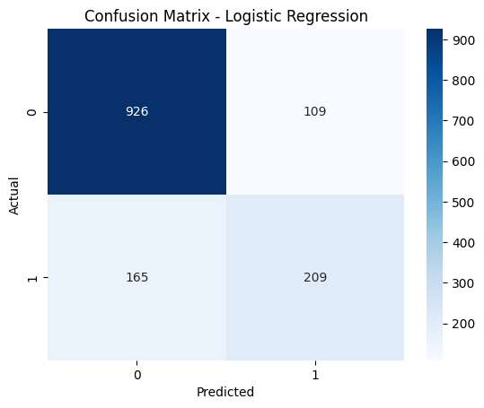

# Customer Churn Prediction

## 📌 Problem Statement
Predict whether a customer will churn based on demographic, contract, and billing information.

## 📊 Dataset
Telco Customer Churn dataset  
Features include tenure, monthly charges, contract type, payment method, etc.

## 🛠️ Approach
- Data cleaning and preprocessing using pipelines
- Handling missing values with imputation
- Encoding categorical variables using OneHotEncoder
- Scaling numeric features using StandardScaler
- Addressed class imbalance
- Built and compared multiple models

## 🤖 Models Used
- Logistic Regression (Baseline & Final Model)
- Random Forest
- XGBoost

## 📈 Evaluation Metrics
- Accuracy
- Precision
- Recall (Churn)
- F1-score
- Confusion Matrix
- ROC Curve

## 🏆 Results
Logistic Regression achieved the best recall and F1-score for churn, making it the most suitable model for customer retention.

## 📌 Key Insights
- Customers with month-to-month contracts churn more
- High monthly charges increase churn probability
- Longer tenure reduces churn risk

## 📂 Project Structure
churn-prediction-ml/
├── data/
├── notebooks/
├── requirements.txt
└── README.md

## 🚀 How to Run
1. Clone the repository
2. Install dependencies using `pip install -r requirements.txt`
3. Run the notebook in `notebooks/`

## Confusion Matrix

